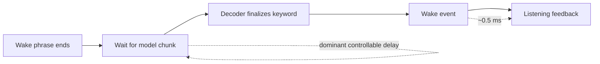

# ADR 0001: Use Sherpa's chunk-8 wake model

- **Status:** Accepted
- **Date:** 2026-08-01
- **Decision owners:** Lobby Wake maintainers

## Context

The user-visible problem was a noticeable pause between finishing “Hey Lobby”
and receiving feedback that the Realtime conversation was listening. Structured
events separated this path into wake detection, harness handoff, connection,
audio upload, response generation, and playback.

The initial measurements showed:

- approximately 545 ms from estimated wake-phrase end to Sherpa emitting a wake;
- approximately 0.5 ms from wake emission to visible listening feedback;
- approximately 1–2 ms for the warm Python handoff;
- sub-millisecond response-audio-to-playback handoff.

The dominant local activation delay was therefore inside wake detection, not
Python orchestration, Realtime preconnection, or playback.

## Investigation



Changing microphone callback blocks between 20, 40, and 80 ms did not
materially change wake timing. Changing trailing blanks on the original model
also did not explain the roughly half-second result.

The original GigaSpeech model filename identifies it as `chunk-16`. Sherpa
documents chunk-16 as 320 ms streaming latency and chunk-8 as 160 ms streaming
latency. Observed triggers followed the corresponding model inference cadence.
This confirmed that reducing Python callback size could not remove the model's
chunk latency. See [Sherpa's keyword-model documentation][sherpa-models].

The candidate configurations were evaluated offline against the same 32
approved positive recordings. The phrase-end measurement used the local 10 ms
RMS estimator.

| Configuration | Positive detections | Phrase-end → wake p50 | p95 |
| --- | ---: | ---: | ---: |
| Original GigaSpeech chunk-16 defaults | 13/32 | 530 ms | 760 ms |
| New chunk-8 low-latency defaults | 29/32 | 320 ms | 504 ms |

On the original repeatable fixture, phrase-end-to-wake improved from
approximately 545 ms to 344 ms. The Python detector call itself took about
3.6 ms and wake-to-feedback took about 0.5 ms.

## Decision

Lobby Wake will default to Sherpa's
`sherpa-onnx-kws-zipformer-zh-en-3M-2025-12-20` chunk-8 model with:

| Setting | Default | Reason |
| --- | ---: | --- |
| Model chunk | `8` | 160 ms documented model latency instead of 320 ms |
| Model variant | `int8` | Lower inference cost without reducing measured recall |
| Active paths | `16` | Improved positive detection coverage in the local set |
| Trailing blanks | `0` | Recovered roughly 10–30 ms in chunk-8 experiments |
| Keyword score | `2.0` | Best tested balance within the positive-only sweep |
| Keyword threshold | `0.1` | Improved positive coverage; requires negative validation |

Keyword files will not embed score or threshold overrides. These remain runtime
controls so CLI experiments change the effective decoder configuration.

The exact model chunk, active paths, score, threshold, and trailing blanks are
written to the structured startup log for reproducibility.

## Consequences

Positive consequences:

- The repeatable fixture activates roughly 200 ms sooner.
- The positive recording set detects substantially more often.
- The implementation remains in the existing Sherpa/Python architecture.
- Chunk-16 remains available through `--model-chunk 16` for comparisons.

Costs and risks:

- Sherpa notes that lower model latency can reduce accuracy.
- Score `2.0` and threshold `0.1` are more permissive than the previous
  defaults; false-accept behavior has not been established without negative
  recordings.
- RMS phrase-end estimates are less trustworthy with continuous background
  noise, so relative comparisons are stronger than their absolute values.
- Approximately 300 ms remains between estimated phrase end and wake in typical
  detected samples because chunk-8 still has a 160 ms cadence plus decoder
  finalization.

## Alternatives considered

### Rewrite the harness in Swift or C++

Rejected as a latency fix. Sherpa's Python package already calls native
inference, and measured post-wake Python work is about 1–2 ms. A native macOS
layer may still be valuable for packaging, power management, audio-session
control, launch-at-login behavior, and UI integration.

### Reduce microphone callback size

Rejected as the primary fix. Blocks of 20, 40, and 80 ms reached the same
chunk-16 trigger point.

### Tune only score, threshold, or trailing blanks

Insufficient. These settings affected coverage and recovered small amounts of
finalization time, but could not remove the model's 320 ms inference cadence.

### Keep chunk-16 for accuracy

Not chosen as the default because measured latency is central to the product
experience. The option remains available if later false-accept testing shows
that chunk-8 is unsuitable.

## Reproduction

Install the selected model and regenerate its phone-tokenized keyword file:

```sh
sh scripts/setup-model.sh
```

Run the local wake path against a fixture:

```sh
uv run lobby-wake \
  --agent mock \
  --mock-duration 0 \
  --audio-file recordings/positive/positive-001-quiet.wav \
  --log /tmp/lobby-chunk8.jsonl

uv run lobby-latency-report /tmp/lobby-chunk8.jsonl
```

Compare chunk sizes while keeping the remaining settings fixed:

```sh
uv run lobby-wake --model-chunk 8 --agent mock
uv run lobby-wake --model-chunk 16 --agent mock
```

## Revisit criteria

Revisit this decision when any of the following is true:

- false accepts are unacceptable on a representative negative set;
- a Sherpa model with a shorter documented streaming cadence becomes available;
- a phrase-specific “Hey Lobby” model materially improves p50/p95 latency;
- live measurements show a new post-detection bottleneck above 20 ms;
- the project adopts a native macOS host for reasons other than KWS latency.

[sherpa-models]: https://k2-fsa.github.io/sherpa/onnx/kws/pretrained_models/index.html
