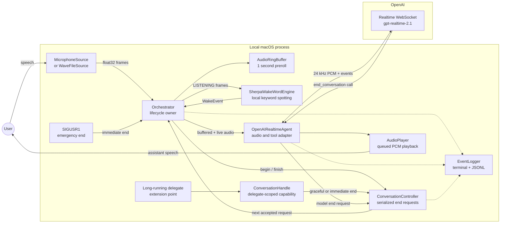
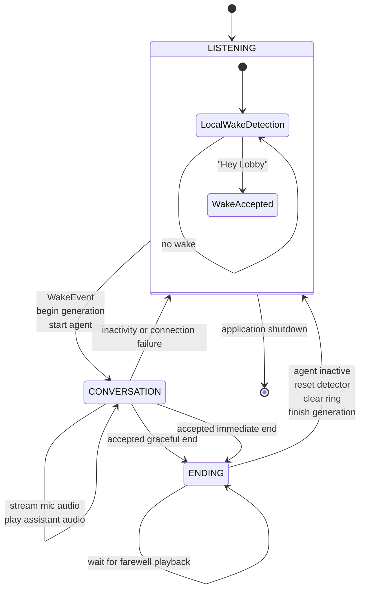
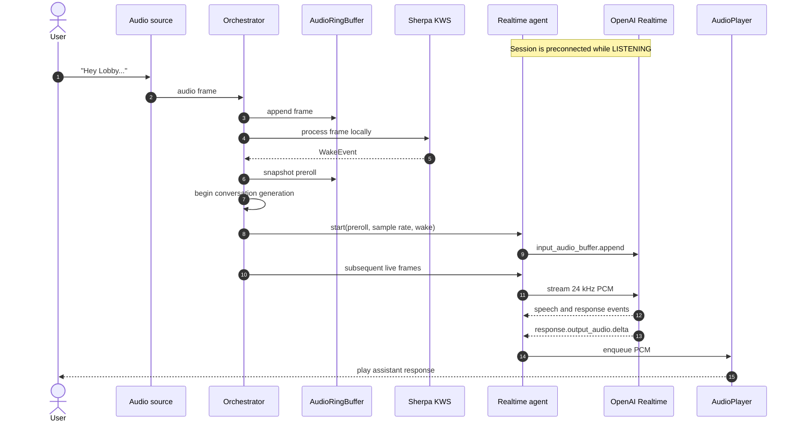
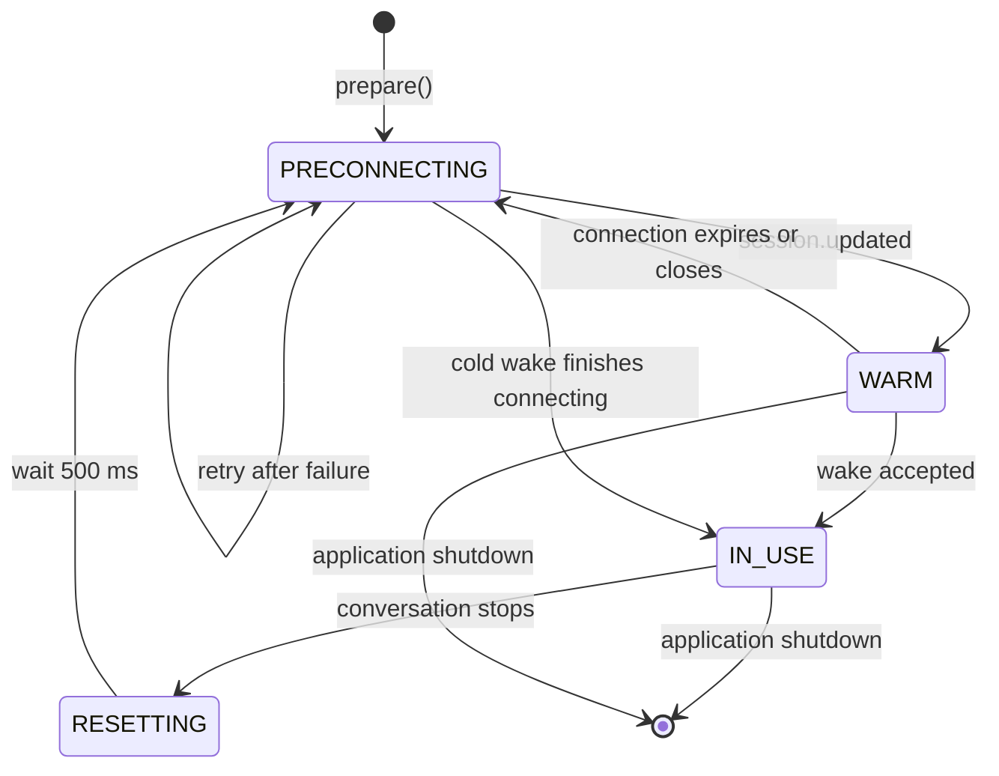
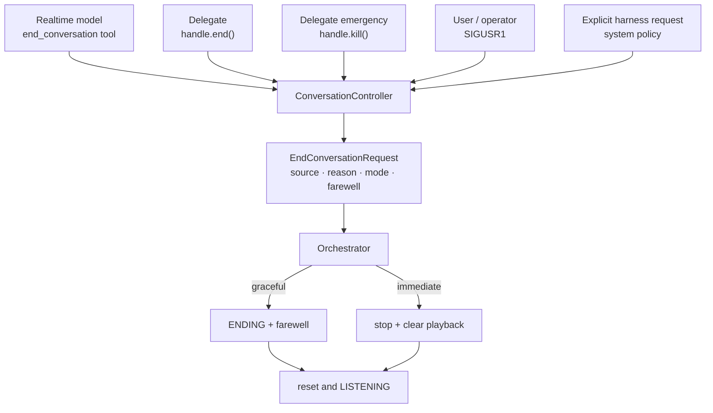
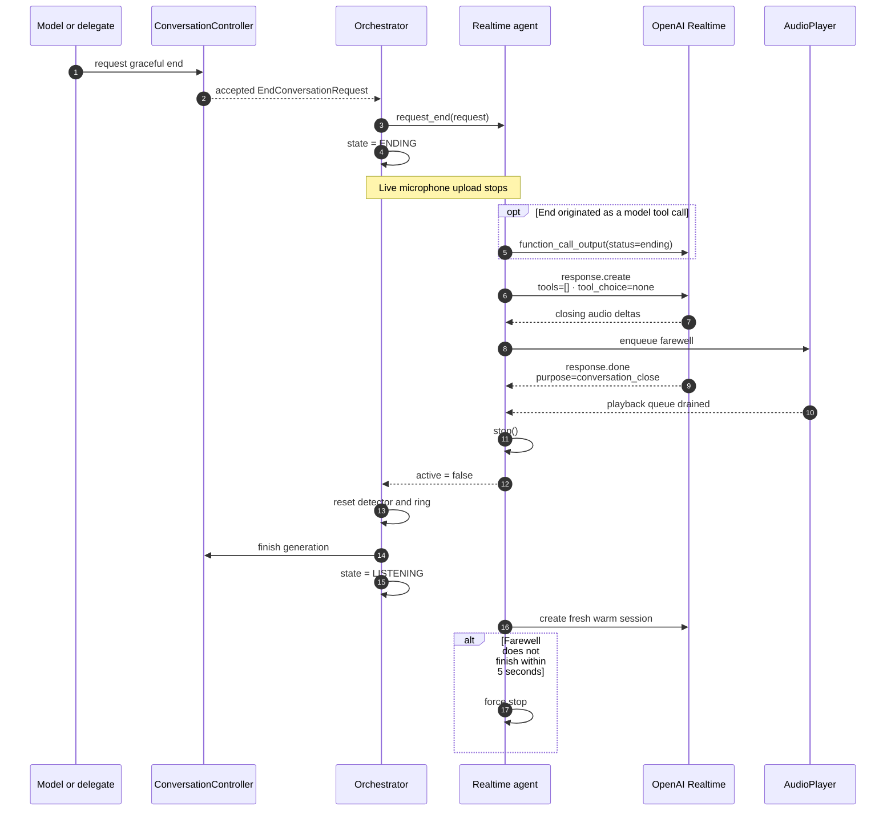
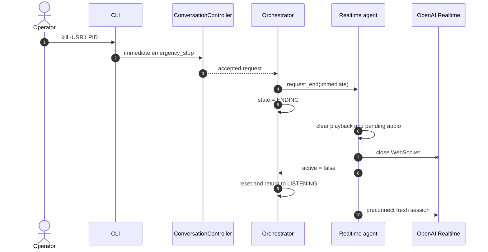
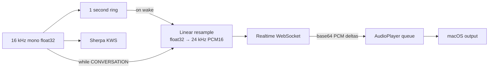

# Lobby Wake Architecture

Lobby Wake is a macOS-first harness that listens locally for **“Hey Lobby”**,
starts one long-running voice delegate, and owns that conversation until it
finishes or is forcibly ended.

Architectural decisions:

- [ADR 0001: Use Sherpa's chunk-8 wake model](adr/0001-use-chunk-8-wake-model.md)

Planned work and research:

- [Roadmap](../TODO.md)
- [Laptop speaker/microphone barge-in](research/laptop-speaker-barge-in.md)

## System overview

The wake detector and rolling buffer remain local. Audio crosses the network
only after a wake has been accepted.

## Ownership

| Component | Owns | Does not own |
| --- | --- | --- |
| `Orchestrator` | Top-level state, audio routing, detector reset, lifecycle transitions | WebSocket protocol details |
| `ConversationController` | One active generation and serialized end requests | Audio or delegate execution |
| `ConversationHandle` | A restricted, generation-scoped delegate capability | Harness internals |
| `OpenAIRealtimeAgent` | Realtime connection, audio conversion, model events, graceful farewell | Top-level lifecycle state |
| `SherpaWakeWordEngine` | Local wake detection | Conversation audio |
| `AudioPlayer` | Non-blocking assistant playback | Microphone capture |
| `EventLogger` | Human terminal logs and structured JSONL events | Audio content |

The harness exposes the delegate seam through
`orchestrator.conversation_handle`. It does not yet prescribe how the delegate
is spawned; an in-process worker or child-process supervisor can receive the
same restricted handle.

## Harness lifecycle

Important consequences:

- Wake detection runs only in `LISTENING`.
- A second wake cannot create an overlapping conversation.
- Microphone upload stops in `ENDING`.
- An immediate end can collapse `ENDING → LISTENING` in the same audio tick.
- Inactivity and unexpected disconnection may stop the agent directly and
  return the harness to `LISTENING`.

## Wake-to-conversation sequence

### Warm and cold connection paths

Preconnection is the default. `--no-preconnect` preserves the cold path for
latency comparisons. Every completed conversation receives a fresh session so
conversation history is not inherited by the next wake.

## Unified end-request lifecycle

All termination sources become an `EndConversationRequest`:

The controller enforces these rules:

1. Requests are accepted only while a conversation generation is active.
2. Duplicate requests are idempotent.
3. An immediate request can replace a pending graceful request.
4. Delegate handles carry a generation number; a stale delegate cannot end a
   newer conversation.

## Graceful model or delegate ending

The final `response.create` clears tools for that response, preventing a
recursive `end_conversation` call. The harness waits for both `response.done`
and the local playback queue to drain before closing.

## Immediate emergency ending

`SIGUSR1` ends only the active conversation. `Ctrl-C` or `SIGTERM` closes the
entire application.

## Audio routing

Laptop-speaker mode is half-duplex by default: microphone upload pauses while
assistant audio is queued or playing to reduce feedback. `--full-duplex`
continues upload for headphones or an already echo-cancelled audio device, but
correct WebSocket playback cancellation and item truncation are still planned.
Built-in speaker/microphone full duplex also requires an AEC media path; see the
[research note](research/laptop-speaker-barge-in.md).

## Key invariants

- There is at most one active conversation generation.
- Audio is never persisted by the harness.
- Wake audio is retained long enough to bridge local detection and remote
  conversation startup.
- Only the harness transitions back to wake listening.
- Delegates receive a restricted capability, not the Realtime socket or
  orchestrator internals.
- Graceful termination is bounded; emergency termination is always available.
- Secrets are loaded from `.env`, excluded from Git, and never included in
  lifecycle logs.

## Implementation map

| Area | File |
| --- | --- |
| Top-level lifecycle and routing | `src/lobby_wake/orchestrator.py` |
| End requests and delegate capability | `src/lobby_wake/conversation.py` |
| Realtime connection, tools, and audio | `src/lobby_wake/realtime.py` |
| Wake detection | `src/lobby_wake/wake.py` |
| Microphone and WAV sources | `src/lobby_wake/audio.py` |
| Rolling preroll buffer | `src/lobby_wake/ring_buffer.py` |
| Speaker playback | `src/lobby_wake/playback.py` |
| Human and JSONL logging | `src/lobby_wake/events.py` |
| CLI assembly and signals | `src/lobby_wake/cli.py` |
