# Lobby Wake Architecture

Lobby Wake is a macOS-first harness that listens locally for wake triggers,
routes a match to one long-running delegate, and owns that exclusive
conversation until it finishes or is forcibly ended. The current application
configures only **“Hey Lobby”**; the library API preserves the routed daemon
boundary for additional assistants.

Architectural decisions:

- [ADR 0001: Use Sherpa's chunk-8 wake model](adr/0001-use-chunk-8-wake-model.md)

Planned work and research:

- [Canonical current latency pipeline](latency-pipeline.md)
- [Delegate process protocol](delegate-process-protocol.md)
- [Routed library API](library-api.md)
- [Roadmap](../TODO.md)
- [Laptop speaker/microphone barge-in](research/laptop-speaker-barge-in.md)

## System overview

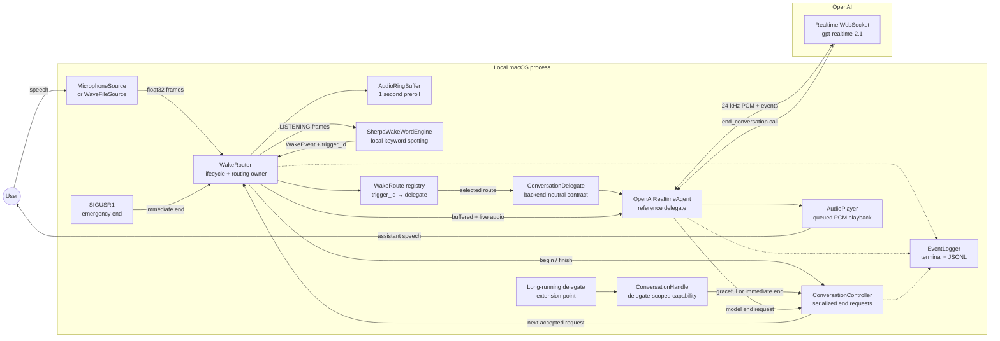

The wake detector and rolling buffer remain local. Audio crosses the network
only after a wake has been accepted.

## Ownership

| Component | Owns | Does not own |
| --- | --- | --- |
| `WakeRouter` | Top-level state, trigger routing, exclusive activation, detector reset | Backend protocol details |
| `WakeRoute` | Immutable trigger ownership and delegate selection | Conversation state |
| `WakeListener` | One-route convenience API over `WakeRouter` | A separate lifecycle implementation |
| `ConversationController` | One active generation and serialized end requests | Audio or delegate execution |
| `ConversationHandle` | A restricted, generation-scoped delegate capability | Harness internals |
| `ConversationDelegate` | Pre-wake preparation, activation, status, audio ownership, and shutdown contract | Any backend protocol |
| `OpenAIRealtimeAgent` | Realtime connection, audio conversion, model events, graceful farewell | Top-level lifecycle state |
| `SherpaWakeWordEngine` | Local wake detection | Conversation audio |
| `AudioPlayer` | Non-blocking assistant playback | Microphone capture |
| `EventLogger` | Human terminal logs and structured JSONL events | Audio content |

The harness depends on `ConversationDelegate`, not OpenAI Realtime. The current
Realtime class implements that contract in-process, and the supervised adapter
translates the same lifecycle to child-process messages. Routing does not alter
the delegate contract.

## Routed daemon boundary

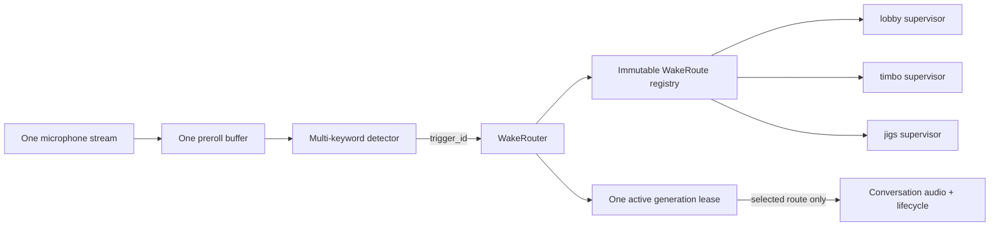

The daemon replaces several competing listeners; it does not coordinate
multiple wake daemons. Each trigger has exactly one route owner, and all routes
share one conversation controller. The current CLI creates only the `lobby`
route. Direct delegate-to-delegate handoff is reserved for a future atomic
router operation.

## Delegate contract

The delegate lifecycle deliberately begins before the wake event:

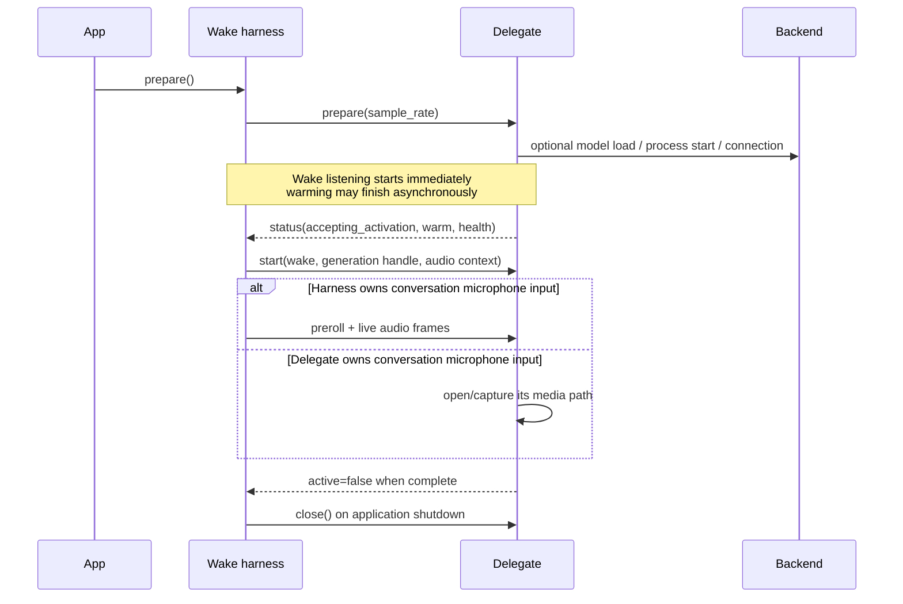

Contract semantics:

- `prepare(context)` is idempotent and is called before wake listening. A
  delegate may load a local model, start a worker, authenticate, or preconnect a
  socket. Preparation can be asynchronous; `status.warm` reports whether the
  optimized path is ready.
- `status.accepting_activation` is separate from `status.warm`. A delegate can
  accept a wake on a cold path while warming is still in progress. If it is
  false, the harness records the unavailable activation and remains in wake
  listening rather than creating a broken conversation generation.
- `start(context)` receives the wake event, source sample rate, optional
  buffered audio, and a generation-scoped `ConversationHandle`. It must never
  cause a second overlapping activation.
- `AudioInputOwnership.HARNESS` receives the preroll and subsequent frames.
  `DELEGATE` receives no audio from the harness and may own a WebRTC or native
  conversation media path instead.
- Graceful and immediate end requests flow from the harness to
  `request_end`. The scoped handle allows the delegate to request the reverse
  transition without gaining access to orchestrator internals.
- `FAILED` status distinguishes a delegate failure from a normal completion.
  The supervised process adapter restarts failed workers without putting that
  policy into the wake-word core.

## Harness lifecycle

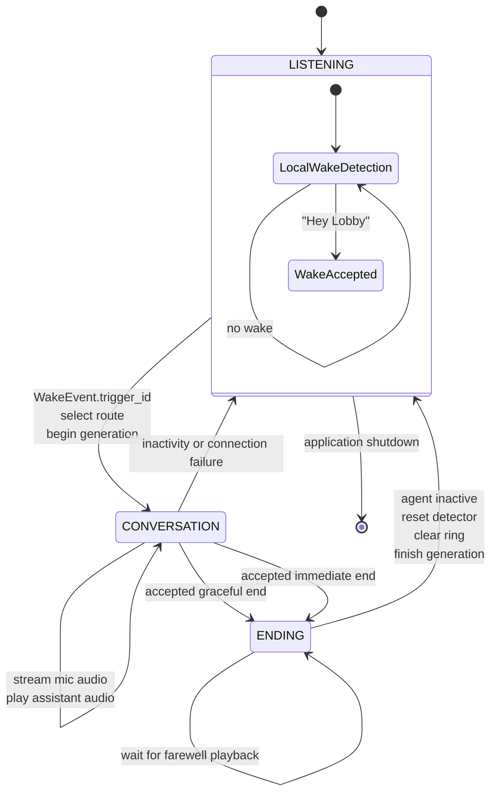

Important consequences:

- Wake detection runs only in `LISTENING`.
- A second wake cannot create an overlapping conversation.
- Only the active route receives conversation audio.
- Microphone upload stops in `ENDING`.
- An immediate end can collapse `ENDING → LISTENING` in the same audio tick.
- Inactivity and unexpected disconnection may stop the agent directly and
  return the harness to `LISTENING`.

## Wake-to-conversation sequence

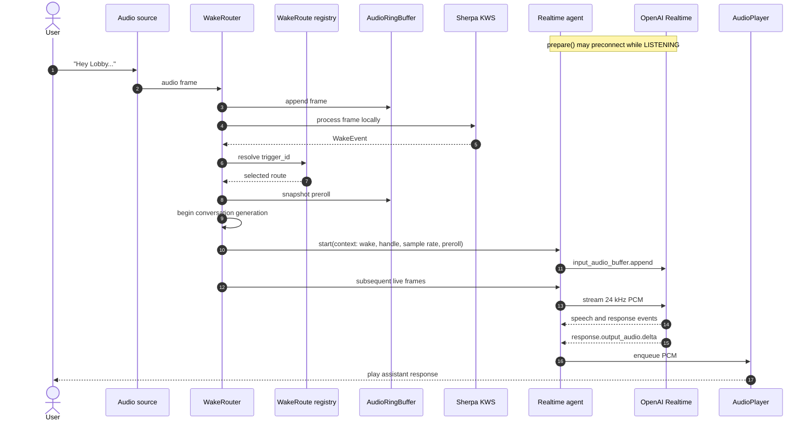

### Warm and cold connection paths

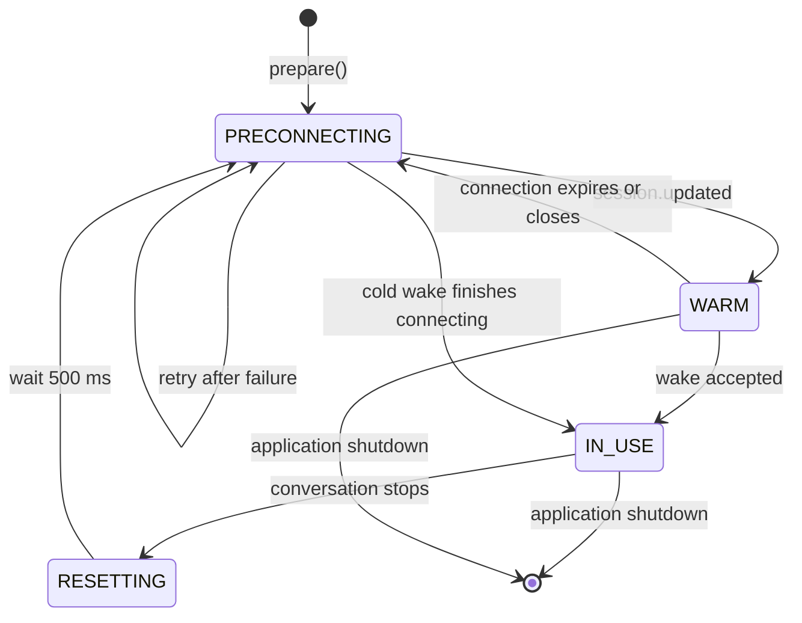

Preconnection is the default. `--no-preconnect` preserves the cold path for
latency comparisons. Every completed conversation receives a fresh session so
conversation history is not inherited by the next wake.

## WebSocket barge-in lifecycle

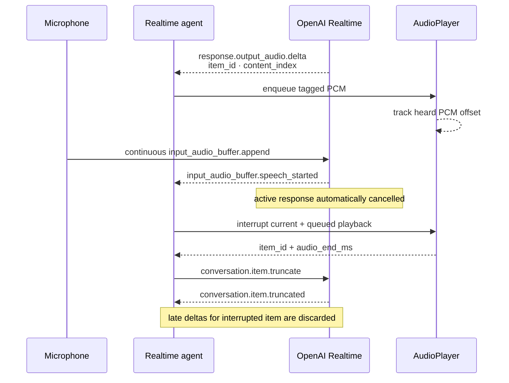

This lifecycle is enabled by default for headphones and echo-cancelled inputs.
`--no-full-duplex` disables microphone upload during playback as a temporary
laptop-speaker fallback; that mode cannot support interruption.

## Unified end-request lifecycle

All termination sources become an `EndConversationRequest`:

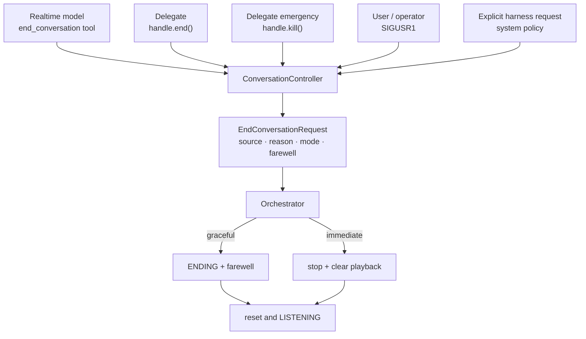

The controller enforces these rules:

1. Requests are accepted only while a conversation generation is active.
2. Duplicate requests are idempotent.
3. An immediate request can replace a pending graceful request.
4. Delegate handles carry a generation number; a stale delegate cannot end a
   newer conversation.

## Graceful model or delegate ending

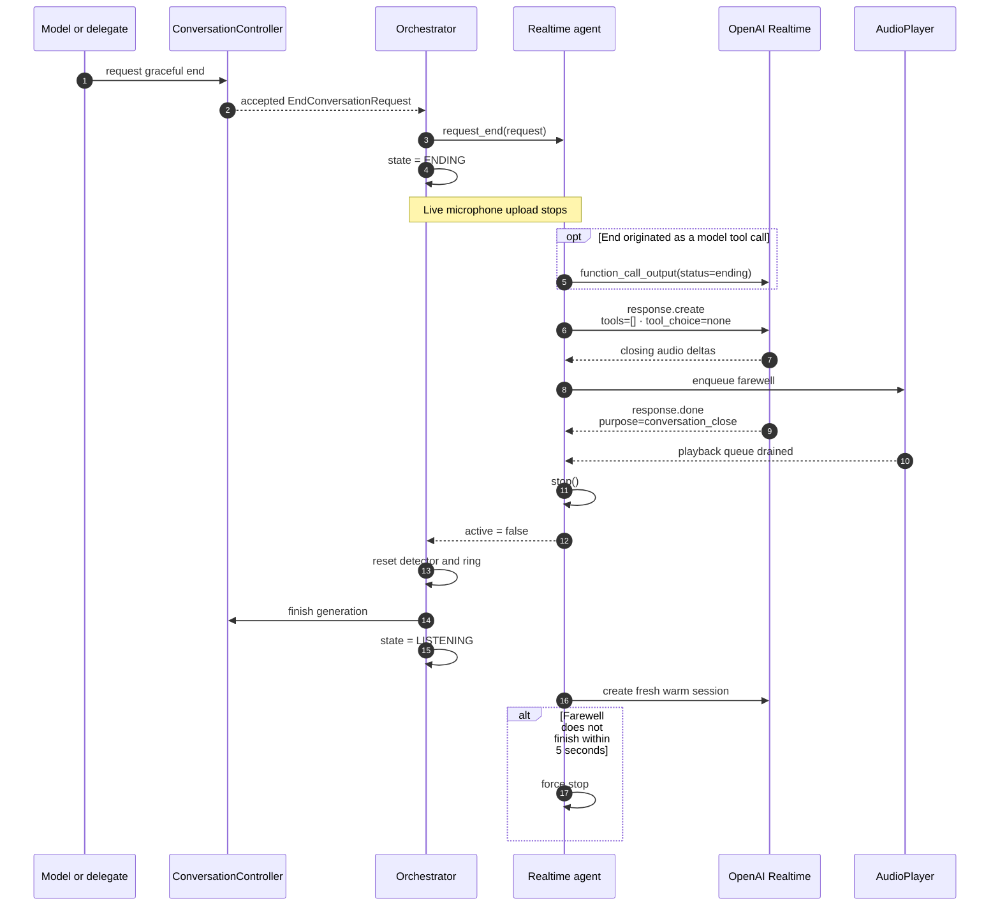

The final `response.create` clears tools for that response, preventing a
recursive `end_conversation` call. The harness waits for both `response.done`
and the local playback queue to drain before closing.

## Immediate emergency ending

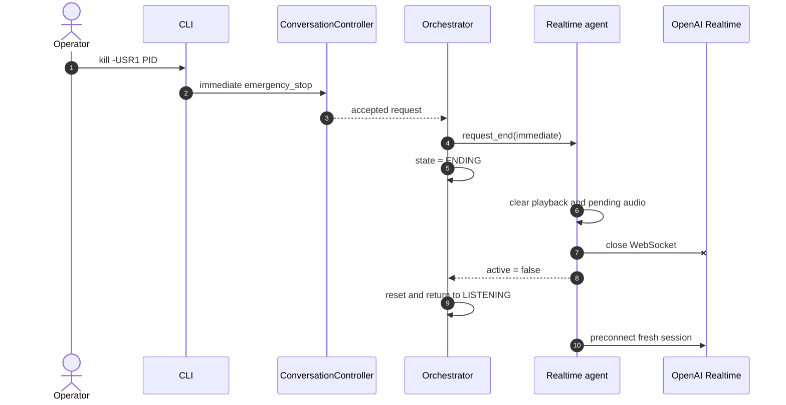

`SIGUSR1` ends only the active conversation. `Ctrl-C` or `SIGTERM` closes the
entire application.

## Audio routing

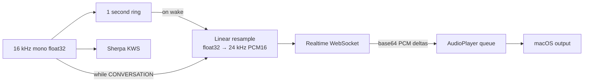

Full duplex is the default so server VAD can hear an interruption. On
`input_audio_buffer.speech_started`, the WebSocket client aborts current and
queued playback, estimates the audio duration heard for the active assistant
item, and sends `conversation.item.truncate`. `--no-full-duplex` is the
half-duplex fallback for unprocessed speaker output. Built-in
speaker/microphone full duplex still requires an AEC media path; see the
[research note](research/laptop-speaker-barge-in.md).

## Key invariants

- There is at most one active conversation generation.
- Audio is never persisted by the harness.
- Wake audio is retained long enough to bridge local detection and remote
  conversation startup.
- Only the harness transitions back to wake listening.
- Delegates receive a restricted capability, not the Realtime socket or
  orchestrator internals.
- Graceful termination is bounded; emergency termination is always available.
- Secrets are loaded from `.env`, excluded from Git, and never included in
  lifecycle logs.

## Implementation map

| Area | File |
| --- | --- |
| Routed lifecycle and public listener API | `src/lobby_wake/orchestrator.py` |
| Delegate lifecycle contract | `src/lobby_wake/agent.py` |
| End requests and delegate capability | `src/lobby_wake/conversation.py` |
| Realtime connection, tools, and audio | `src/lobby_wake/realtime.py` |
| Wake detection | `src/lobby_wake/wake.py` |
| Microphone and WAV sources | `src/lobby_wake/audio.py` |
| Rolling preroll buffer | `src/lobby_wake/ring_buffer.py` |
| Speaker playback | `src/lobby_wake/playback.py` |
| Human and JSONL logging | `src/lobby_wake/events.py` |
| CLI assembly and signals | `src/lobby_wake/cli.py` |
