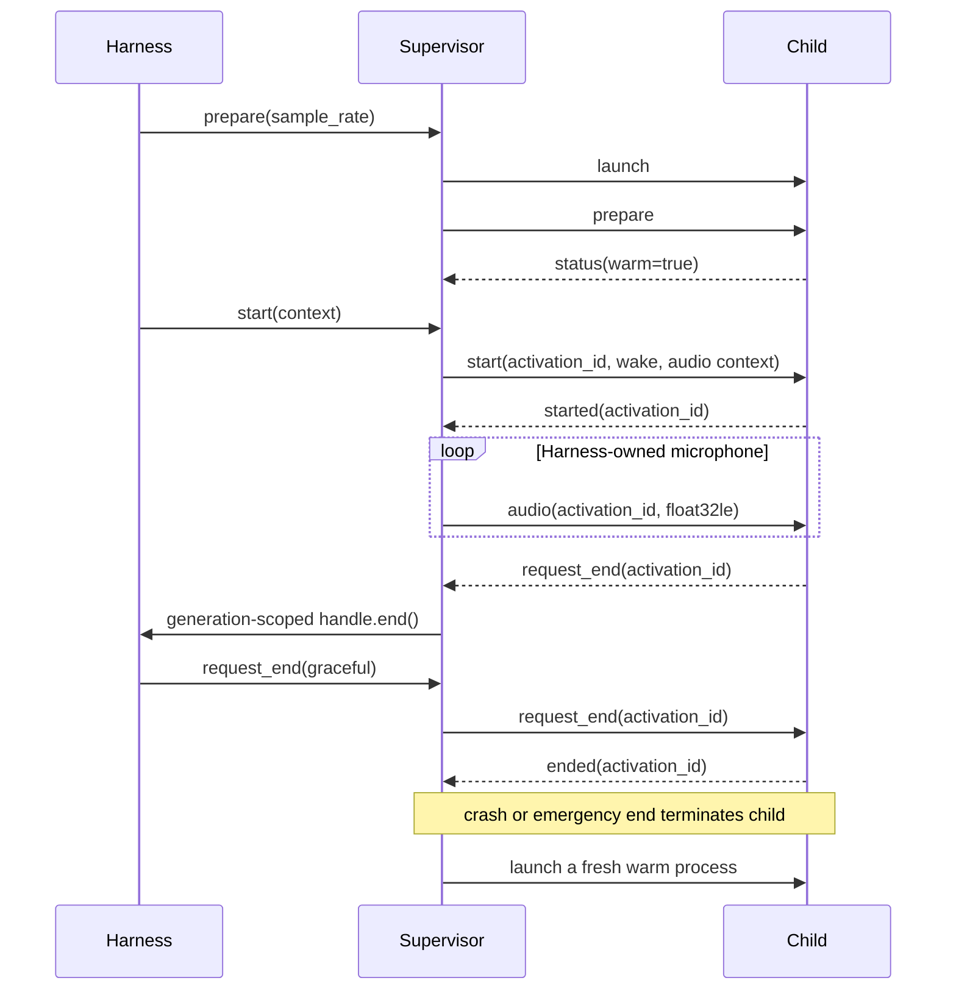

# Delegate process protocol

The supervised process adapter lets Wake On remain a wake-word library while a
separate long-running process owns the conversation backend. The protocol is
backend-neutral: the child can use OpenAI Realtime, another hosted service, a
local model, WebRTC, or native audio.

## Transport and process rules

- The parent launches an argument vector directly, without a shell.
- Messages are UTF-8 JSON objects, one per line.
- Parent commands arrive on child stdin. Child events leave on stdout.
- Child stdout is reserved for protocol messages. Human logs belong on stderr.
- Every message contains `"v": 1` and a `type`.
- One protocol line may not exceed 2 MiB.
- The child is long-running and may handle multiple sequential activations.
- The child inherits the Wake On process environment by default. The command
  and environment are never written to lifecycle logs, but child stderr is.

## Lifecycle



The opaque `activation_id` scopes all conversation messages. The parent keeps
the actual `ConversationHandle`; therefore a message from an old activation or
process generation cannot end a newer conversation.

## Parent commands

### `prepare`

Sent immediately after launch, before wake listening begins.

```json
{"v":1,"type":"prepare","sample_rate":16000,"audio_input":"harness"}
```

`audio_input` is either:

- `harness`: the parent sends preroll and live microphone frames.
- `delegate`: the child owns its conversation media capture, such as WebRTC.

### `start`

```json
{
  "v": 1,
  "type": "start",
  "activation_id": "opaque-id",
  "route_id": "lobby",
  "wake": {
    "phrase": "HEY LOBBY",
    "trigger_id": "hey_lobby",
    "detected_at_ns": 1234
  },
  "sample_rate": 16000,
  "initial_audio": {
    "encoding": "float32le",
    "samples": 16000,
    "data": "base64..."
  }
}
```

`initial_audio` is omitted when the child owns input. Audio is mono,
little-endian float32 with nominal values in `[-1, 1]`.

### `audio`

```json
{
  "v": 1,
  "type": "audio",
  "activation_id": "opaque-id",
  "sample_rate": 16000,
  "audio": {"encoding": "float32le", "samples": 320, "data": "base64..."}
}
```

### `request_end`

Asks the child to finish the active conversation. `mode` is `graceful` or
`immediate`. Immediate mode also terminates the child so a hung delegate cannot
block the emergency path. A graceful request is force-terminated after the
configured deadline.

```json
{
  "v": 1,
  "type": "request_end",
  "activation_id": "opaque-id",
  "source": "user",
  "reason": "requested",
  "mode": "graceful",
  "farewell": "Talk soon."
}
```

`stop` abandons one activation but keeps the worker. `close` shuts the worker
down when Wake On exits.

## Child events

### `status`

```json
{
  "v": 1,
  "type": "status",
  "health": "ready",
  "accepting_activation": true,
  "warm": true,
  "detail": "backend connection ready"
}
```

Health is `created`, `ready`, `degraded`, `failed`, or `closed`.
`accepting_activation` means a wake may be accepted now. `warm` only means the
optimized path is ready; it may be false while cold activation remains valid.

### Activation events

The child sends `started` and `ended` with the current `activation_id`:

```json
{"v":1,"type":"started","activation_id":"opaque-id"}
{"v":1,"type":"ended","activation_id":"opaque-id","reason":"complete"}
```

### Child-requested end

```json
{
  "v": 1,
  "type": "request_end",
  "activation_id": "opaque-id",
  "reason": "task_complete",
  "farewell": "All done.",
  "immediate": false
}
```

The supervisor ignores the request unless the activation ID matches the active
generation.

The parent logs `delegate.activation_sent` and `delegate.activation_started`
with wake-to-send, protocol-write, and parent-to-child dispatch timing. These
fields are included in the standard latency report.

### Logging

Plain application logs should go to stderr. A child may emit a structured
protocol log when fields are useful:

```json
{"v":1,"type":"log","message":"connected","fields":{"latency_ms":82}}
```

A backend adapter may forward canonical harness metrics using an `agent.*`
event. The supervisor preserves the event name, marks it with
`delegate_transport=process`, and gives it a parent-process timestamp:

```json
{
  "v": 1,
  "type": "event",
  "event": "agent.first_response_received",
  "fields": {"wake_to_response_ms": 784.08}
}
```

Other event namespaces are rejected so a child cannot impersonate wake or
orchestrator lifecycle events.

## OpenAI Realtime reference child

The bundled reference child hosts the same `OpenAIRealtimeAgent` used by the
in-process CLI path. It preconnects before wake, accepts harness-owned float32
audio, owns response playback, forwards `agent.*` latency events, and relays
model-requested conversation ending through the generation-scoped parent
handle:

```sh
uv run lobby-wake \
  --agent process \
  --delegate-command python -m lobby_wake.openai_process_delegate
```

Its options appear after `--delegate-command`; run
`python -m lobby_wake.openai_process_delegate --help` for the backend-specific
model, voice, VAD, preconnection, duplex, and output-device settings.

## Running an external delegate

All Wake On options must appear before `--delegate-command`; the remainder is
passed verbatim to the child without shell parsing:

```sh
uv run lobby-wake \
  --agent process \
  --delegate-audio-input harness \
  --delegate-command python path/to/delegate.py --backend-option value
```

Use `--delegate-audio-input delegate` when the child opens its own WebRTC or
native conversation media path.
