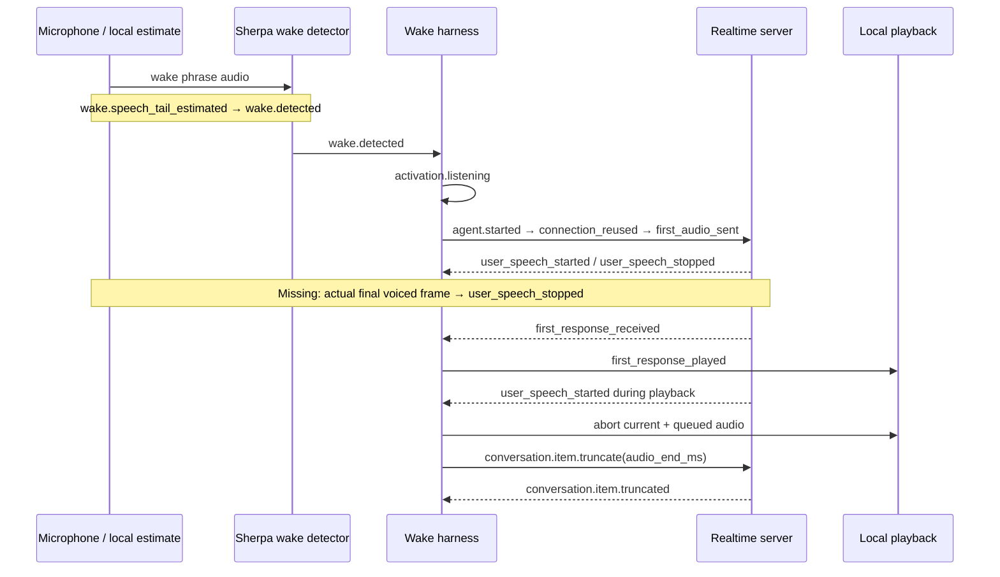

# Current latency pipeline

**Canonical snapshot — 2026-08-02.** This page is the at-a-glance source of
truth for the latency work. It separates measurements we can act on from
configured delays and boundaries we still do not measure. See
[the latency notebook](latency.md) for experiment history and methodology.

## At a glance

```mermaid
flowchart LR
    subgraph Activation["1 · Wake activation"]
        Phrase["Wake phrase ends"]
        Sherpa["Sherpa detects wake<br/><b>320 ms p50 · 504 ms p95</b><br/>29/32 positive samples"]
        Feedback["Listening feedback<br/><b>~0.5 ms</b>"]
        Warm["Warm agent handoff<br/><b>~1 ms</b>"]
        Upload["First microphone audio sent<br/><b>2–12 ms observed</b>"]
        Phrase --> Sherpa --> Feedback --> Warm --> Upload
    end

    subgraph Turn["2 · Realtime turn handoff"]
        FinalWord["User's final word"]
        Endpoint["Server VAD endpoint<br/><b>UNKNOWN</b><br/>300 ms silence configured"]
        Stopped["speech_stopped"]
        Model["First response audio<br/><b>571 ms median · n=3</b><br/>414–905 ms observed"]
        Play["Local playback<br/><b>&lt;1 ms</b>"]
        FinalWord --> Endpoint --> Stopped --> Model --> Play
    end

    Upload -. "conversation continues" .-> FinalWord

    classDef measured fill:#e8f5e9,stroke:#2e7d32,color:#1b1b1b
    classDef estimate fill:#fff8e1,stroke:#f9a825,color:#1b1b1b
    classDef missing fill:#ffebee,stroke:#c62828,color:#1b1b1b
    class Sherpa,Feedback,Warm,Upload,Model,Play measured
    class Phrase,FinalWord estimate
    class Endpoint missing
```



Green stages are measured, yellow boundaries are locally estimated, and red is
the missing measurement. The two phases are not one continuous stopwatch: the
user can speak for any length of time after activation.

## What currently dominates

1. **Wake finalization:** about 320 ms p50 after the estimated phrase end.
2. **Turn endpointing:** unknown from the actual final voiced frame to the
   server's `speech_stopped` event. Server VAD currently requires 300 ms of
   silence, but transport and detection overhead are not yet isolated.
3. **Remote response:** 414–905 ms from server `speech_stopped` to first response
   audio in three current server-VAD conversations. The sample is too small for
   a stable percentile. Older semantic-VAD runs measured 576 ms p50 and 694 ms
   p95 over seven conversations.

Everything after wake detection and before the network response is currently
single-digit milliseconds on the warm path. A Python-to-native rewrite would
therefore not target either dominant delay.

## Measurement ledger

| Boundary | Current value | Evidence | Confidence / next action |
| --- | ---: | --- | --- |
| Estimated wake-phrase end → `wake.detected` | 320 ms p50; 504 ms p95 | 29 detections from 32 approved positive recordings, chunk-8 profile | Good for relative model comparisons; RMS phrase-tail estimate limits absolute accuracy |
| `wake.detected` → listening feedback | ~0.5 ms | Instrumented local runs | High; not a tuning target |
| `wake.detected` → warm connection available | ~1 ms | Preconnected Realtime runs | High while preconnection is healthy |
| `wake.detected` → first microphone audio sent | 2–12 ms observed | Recent warm server-VAD runs | Small sample; already below material perception threshold |
| Actual final voiced frame → `agent.user_speech_stopped` | **Not measured** | Server VAD configured with 300 ms silence | Add a local voiced-frame timestamp; compare 200/300/500 ms and semantic VAD high |
| `agent.user_speech_stopped` → first response audio | 571 ms median; 414–905 ms range | 3 current server-VAD conversations | Insufficient sample; collect per-turn first-audio events |
| First response received → first response played | <1 ms | Instrumented local runs | High; not a tuning target |
| Server VAD speech-start event → playback stopped | 117 ms initial smoke test | One synthetic live interruption; `agent.playback_interrupted` records `vad_to_playback_stop_ms` | Collect a real headphone distribution; laptop speakers still require AEC |

## Current runtime profile

| Layer | Current default |
| --- | --- |
| Wake model | Sherpa ONNX English chunk-8, int8 |
| Wake decoder | 16 active paths, 0 trailing blanks, score 2.0, threshold 0.1 |
| Realtime connection | Preconnected and reused on wake |
| Turn detection | `server_vad`, threshold 0.5, 300 ms silence, 300 ms prefix padding |
| Duplex behavior | `raw-full-duplex` default; `raw-half-duplex` fallback; opt-in `native-aec` |

## Canonical event boundaries



Refresh the event-derived report after a run with:

```sh
uv run lobby-latency-report latency.jsonl
```

The immediate measurement work is tracked in the [roadmap](../TODO.md). The
[wake-model ADR](adr/0001-use-chunk-8-wake-model.md) records why chunk-8 is the
current baseline, and the [laptop barge-in research](research/laptop-speaker-barge-in.md)
covers the interruption/AEC boundary.
