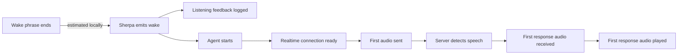

# Latency baseline

Lobby Wake records timestamps at each boundary so perceived activation delay
can be attributed to the wake detector, local harness, network connection,
Realtime speech detection, model response, or playback.

## Activation path



The event log contains monotonic timestamps and explicit duration fields. Build
a percentile report from one or more runs with:

```sh
uv run lobby-latency-report latency.jsonl
```

## Initial measurements

These numbers establish direction, not a performance guarantee. Historical
values combine a small number of development runs. The phrase-end measurement
comes from one repeatable WAV fixture and uses an in-memory RMS estimate.

| Stage | Initial result | Interpretation |
| --- | ---: | --- |
| Estimated phrase end → wake | 545 ms | Largest local activation gap |
| Wake → listening feedback | 0.54 ms | Harness feedback is effectively immediate |
| Wake → warm connection | 1.08 ms p50 | Preconnection removes startup cost |
| Wake → cold connection | 104 ms in latest run; 900 ms historical p50 | Avoid the cold path |
| Wake → first audio upload | 106 ms on cold run | Dominated by connection readiness |
| Speech stop → first response audio | 586 ms on latest run; 576 ms historical p50 | Remote response path |
| Response received → playback | 0.92 ms on latest run; 0.40 ms historical p50 | Local playback handoff is negligible |

Audio callback blocks of 20, 40, and 80 ms all emitted the wake at approximately
the same point in the fixture: 547, 545, and 551 ms after estimated phrase end.
Callback size is therefore not the first tuning target.

## Measurement protocol

For a useful distribution:

1. Keep the model, keyword file, score, threshold, trailing blanks, hardware,
   room, and microphone position fixed.
2. Capture at least 30 successful activations plus negative/background samples.
3. Run the same fixture or phrase set for each candidate configuration.
4. Compare p50 and p95 activation latency together with false accepts and false
   rejects. Latency alone is not a safe wake-model objective.
5. Separate warm and cold Realtime connection results.

The phrase-end estimator analyzes 10 ms RMS windows in the one-second preroll
buffer and retains no audio. It is suitable for relative tuning. An annotated
fixture is more trustworthy when background noise is close to speech volume.

## Native implementation decision

Do not rewrite the harness in Swift or C++ for latency yet. Sherpa's Python
package already invokes its native inference engine, and measured Python
orchestration after wake is about 1–2 ms. A native macOS layer may still be
worthwhile later for distribution, launch-at-login integration, audio-session
control, power usage, and UI feedback, but it cannot recover the roughly
545 ms currently spent before the detector emits.

Sherpa's `num_trailing_blanks` is exposed through `--trailing-blanks`. An
initial fixture run at `0`, `1`, and `2` produced the same approximate 545 ms
result, so the value remains at Sherpa's default of `1`.

The next experiment should collect a representative phrase and negative-audio
set, then compare keyword score, threshold, and candidate wake models while
recording both latency and accuracy.
