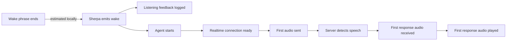

# Latency baseline

The canonical at-a-glance state of every latency boundary is
[Current latency pipeline](latency-pipeline.md). This document retains the
experiment history, rationale, and measurement protocol behind that snapshot.

The accepted model-selection decision and complete experiment rationale are in
[ADR 0001: Use Sherpa's chunk-8 wake model](adr/0001-use-chunk-8-wake-model.md).

Lobby Wake records timestamps at each boundary so perceived activation delay
can be attributed to the wake detector, local harness, network connection,
Realtime speech detection, model response, or playback.

## Activation path



The event log contains monotonic timestamps and explicit duration fields. Build
a percentile report from one or more runs with:

```sh
uv run lobby-latency-report latency.jsonl
```

## Initial measurements

These numbers establish direction, not a performance guarantee. Historical
values combine a small number of development runs. The phrase-end measurement
comes from one repeatable WAV fixture and uses an in-memory RMS estimate.

| Stage | Initial result | Interpretation |
| --- | ---: | --- |
| Estimated phrase end → wake | 545 ms | Largest local activation gap |
| Wake → listening feedback | 0.54 ms | Harness feedback is effectively immediate |
| Wake → warm connection | 1.08 ms p50 | Preconnection removes startup cost |
| Wake → cold connection | 104 ms in latest run; 900 ms historical p50 | Avoid the cold path |
| Wake → first audio upload | 106 ms on cold run | Dominated by connection readiness |
| Speech stop → first response audio | 586 ms on latest run; 576 ms historical p50 | Remote response path |
| Response received → playback | 0.92 ms on latest run; 0.40 ms historical p50 | Local playback handoff is negligible |

## Delegate boundary benchmark

The delegate contract and supervised process adapter were benchmarked locally
on 2026-08-02 with 100 activations and a one-second, 16 kHz float32 preroll:

```sh
.venv/bin/python scripts/benchmark_delegate_latency.py \
  --iterations 100 \
  --preroll-ms 1000
```

| Boundary | p50 | p95 | max |
| --- | ---: | ---: | ---: |
| Existing in-process OpenAI warm `start()` | 0.370 ms | 0.443 ms | 1.064 ms |
| Process delegate parent `start()` | 0.366 ms | 0.450 ms | 0.862 ms |
| Process send → child `started` acknowledgement | 0.489 ms | 0.610 ms | 1.000 ms |

The external process boundary adds roughly 0.12 ms at p50 relative to the
in-process call completing, which is negligible beside the measured wake-model
and remote-response stages. This is a synthetic local dispatch benchmark, not
a replacement for trigger-to-first-audio testing: it excludes Sherpa wake
detection, network connection state, VAD endpointing, model inference, and
playback. The OpenAI reference remains in-process, so this change did not put
IPC into its current audio path.

Process delegate logs now expose `wake_to_delegate_start_ms`,
`protocol_write_ms`, and `activation_dispatch_ms`; the standard latency report
includes the first and third boundaries.

### Live OpenAI Realtime process comparison

The actual OpenAI Realtime reference was then run both in-process and behind
the supervised process adapter on 2026-08-02. Both paths used warm
`gpt-realtime-2.1` sessions, server VAD at 300 ms, the same three-second
`positive-002-quiet.wav` input, and real response playback. Three activations
were collected per path:

```sh
.venv/bin/python scripts/compare_openai_delegate_latency.py \
  --runs 3 \
  --timeout 20
```

| Boundary | In-process p50 | Process p50 | Process range |
| --- | ---: | ---: | ---: |
| Wake → first audio uploaded | 26.66 ms | 27.58 ms | 24.26–28.34 ms |
| Server speech stop → first response audio | 457.57 ms | 496.42 ms | 346.10–928.67 ms |
| Wake → first response audio | 707.17 ms | 784.08 ms | 735.73–1238.24 ms |
| Wake → first playback | 707.55 ms | 784.51 ms | 736.03–1238.28 ms |

The process boundary adds approximately **0.92 ms p50** at the first-upload
boundary. That is the controlled local comparison and shows no material IPC
regression. End-to-end response p50 was 76.9 ms slower in this six-request
smoke test, but the difference occurs after server speech stop and the process
runs ranged by 582.6 ms there. With only three samples, it is server-response
variance rather than evidence of a transport regression. Use at least 30
interleaved requests before comparing remote-response percentiles.

Raw structured logs are written to `/tmp/wake-on-openai-inprocess.jsonl` and
`/tmp/wake-on-openai-process.jsonl`. They contain timing metadata, not API keys
or audio content.

## Realtime turn handoff

The original integration explicitly used semantic VAD with high eagerness.
Historical logs measured approximately 576 ms p50 and 694 ms p95 from the
server's `input_audio_buffer.speech_stopped` event to first response audio. They
did not measure how long semantic VAD waited between the user's actual final
word and that event.

Server VAD is now the trial default for a more deterministic handoff:
[OpenAI's VAD guide](https://developers.openai.com/api/docs/guides/realtime-vad)
defines `silence_duration_ms` as the silence required to detect speech stop and
notes that shorter values detect turns faster.

| Setting | Default |
| --- | ---: |
| Mode | `server_vad` |
| Silence duration | 300 ms |
| Activation threshold | 0.5 |
| Prefix padding | 300 ms |

The accepted Realtime session configuration and speech events include the VAD
mode in structured logs. Compare the previous behavior with:

```sh
uv run lobby-wake --realtime-vad semantic_vad --vad-eagerness high
```

Shorter `--vad-silence-ms` values can reduce handoff time but increase the risk
of ending a turn during a natural pause. This should be evaluated by speaking,
pausing mid-sentence, and recording both perceived interruption and the existing
speech-stop-to-playback metric.

Audio callback blocks of 20, 40, and 80 ms all emitted the wake at approximately
the same point in the fixture: 547, 545, and 551 ms after estimated phrase end.
Callback size is therefore not the first tuning target.

## Interruption latency

WebSocket barge-in logs `agent.playback_interrupted` with
`vad_to_playback_stop_ms`, measured from receipt/logging of the server's
`input_audio_buffer.speech_started` event until the local playback stream has
been aborted. The latency report includes this boundary as **VAD speech start →
playback stopped**.

The initial live synthetic smoke test measured 116.83 ms. Realtime cancelled the
active response, confirmed `conversation.item.truncate` at 559 ms of heard
audio, and completed a response to the interrupting turn. This single result
validates the protocol path but is not a performance baseline; collect at least
30 headphone interruptions before using p50 or p95. The measurement also starts
after remote VAD detection, so perceived user-speech-start → playback-stop
latency will be higher until a local near-end detector is added.

## Wake-model latency investigation

The original GigaSpeech model is exported with `chunk_size=16`. [Sherpa's model
documentation](https://k2-fsa.github.io/sherpa/onnx/kws/pretrained_models/index.html)
identifies chunk-16 as 320 ms streaming latency and chunk-8 as 160 ms. Trigger
timestamps from the local recordings followed the same 320 ms inference cadence,
confirming that Python's audio callback size was not responsible for the delay.

Sherpa's newer English-capable model includes a `chunk_size=8` export documented
at 160 ms model latency. On the same 32 approved positive recordings:

| Configuration | Detected | Estimated phrase-end → wake p50 | p95 |
| --- | ---: | ---: | ---: |
| Original GigaSpeech chunk-16 defaults | 13/32 | 530 ms | 760 ms |
| New chunk-8 low-latency defaults | 29/32 | 320 ms | 504 ms |

The default low-latency profile is chunk-8 int8 inference, 16 active paths, zero
trailing blanks, score `2.0`, and threshold `0.1`. A single fixture improved from
approximately 545 ms to 343 ms. These phrase-end values use the RMS estimator,
so the relative result is more reliable than the absolute number, particularly
for recordings containing continuous background noise.

The chunk-8 model recovers about 200 ms at p50 while keeping inference comfortably
faster than real time on the development Mac. The remaining delay is primarily
model finalization and the 160 ms chunk cadence, not Python orchestration.

## Measurement protocol

For a useful distribution:

1. Keep the model, keyword file, score, threshold, trailing blanks, hardware,
   room, and microphone position fixed.
2. Capture at least 30 successful activations plus negative/background samples.
3. Run the same fixture or phrase set for each candidate configuration.
4. Compare p50 and p95 activation latency together with false accepts and false
   rejects. Latency alone is not a safe wake-model objective.
5. Separate warm and cold Realtime connection results.

The phrase-end estimator analyzes 10 ms RMS windows in the one-second preroll
buffer and retains no audio. It is suitable for relative tuning. An annotated
fixture is more trustworthy when background noise is close to speech volume.

## Native implementation decision

Do not rewrite the harness in Swift or C++ for latency yet. Sherpa's Python
package already invokes its native inference engine, and measured Python
orchestration after wake is about 1–2 ms. A native macOS layer may still be
worthwhile later for distribution, launch-at-login integration, audio-session
control, power usage, and UI feedback, but it cannot recover time spent inside
the wake model's inference cadence and finalization.

Sherpa's `num_trailing_blanks` is exposed through `--trailing-blanks`. On the
chunk-8 model, reducing it from `1` to `0` recovered roughly 10–30 ms without
reducing detections in the positive set, so the low-latency profile uses `0`.

The next core latency boundary is model choice: a wake model with a shorter
inference cadence or a phrase-specific classifier. Negative audio is needed
before declaring the more sensitive decoder settings production-safe, but it
is not required to continue measuring activation latency.
