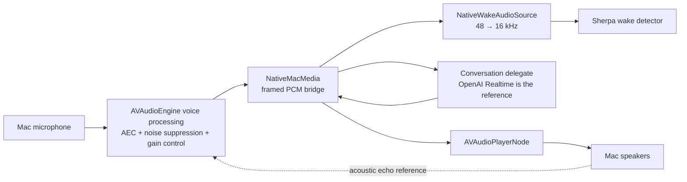

# Native macOS media helper

The native media helper is an optional, backend-neutral conversation media
adapter. It gives a delegate processed microphone capture and assistant
playback through Apple's voice-processing audio path without moving wake
detection, routing, conversation policy, or backend networking into Swift.



The helper owns audio-device access, native voice processing, PCM playback,
and playback completion signals. It does not own an API key, network
connection, model, wake phrase, routing rule, or conversation lifecycle.

## Lifecycle

1. During delegate `prepare()`, `NativeMacMedia` launches the helper and waits
   for its ready message. This keeps native startup off the post-wake path.
2. The helper is the only microphone owner. Every processed capture frame is
   resampled to 16 kHz for the harness-owned Sherpa wake detector. In parallel,
   the bridge retains up to one second of the original 48 kHz PCM.
3. At activation, the delegate enables conversation capture. The bridge flushes
   the 48 kHz processed preroll and then streams live audio to the delegate.
4. Assistant PCM is sent back through the helper. Completion messages let the
   delegate estimate how much audio was heard for WebSocket interruption and
   item truncation.
5. At conversation end, capture is deactivated and a fresh bounded preroll
   begins. On shutdown, Python sends `Q` and supervises helper exit.

## Framed protocol

Each frame is one byte of type, a four-byte unsigned big-endian payload length,
then that many payload bytes.

| Direction | Type | Payload |
| --- | --- | --- |
| Python → Swift | `P` | 8-byte big-endian chunk ID followed by 24 kHz mono PCM16LE |
| Python → Swift | `C` | Empty; clear current and queued playback |
| Python → Swift | `Q` | Empty; shut down cleanly |
| Swift → Python | `R` | UTF-8 JSON readiness and audio-format metadata |
| Swift → Python | `A` | Processed mono PCM16LE microphone audio |
| Swift → Python | `D` | 8-byte big-endian completed playback chunk ID |
| Swift → Python | `E` | UTF-8 JSON error details |

## Build and run

```sh
sh scripts/build-native-media-helper.sh
uv run lobby-wake --conversation-media native-macos
```

The spike currently uses the system default input and output devices. Native
mode deliberately does not open `sounddevice`; two independent clients on the
same microphone reduced wake responsiveness during the first live trial. The
Swift executable is built directly with `swiftc`; it is not yet bundled into a
Python wheel.

## Current limitations

- Wake-phrase sensitivity on the processed 16 kHz branch still needs a measured
  comparison with raw `sounddevice` capture.
- `AVAudioEngine` is a high-level first implementation. If its capture cadence
  or interruption latency is inadequate, the next native experiment is direct
  Voice Processing I/O (`AUVoiceIO`).
- Playback timing is inferred from queued/completed PCM chunks. A production
  adapter may need tighter device-time accounting for exact truncation.
