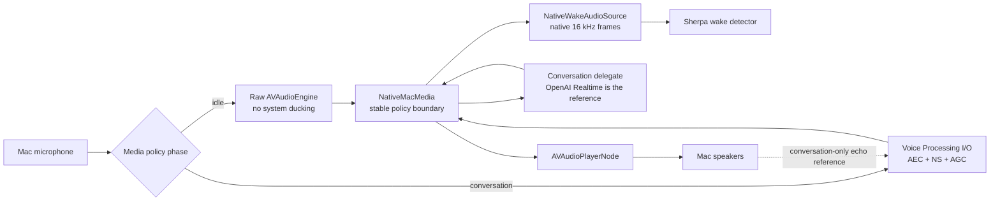
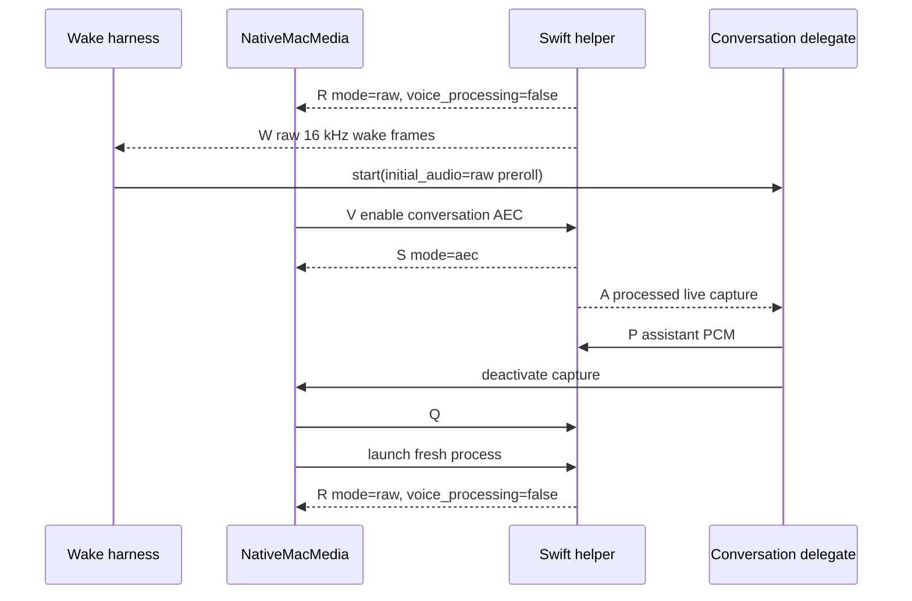

# Native macOS media helper

The native media helper is an optional, backend-neutral conversation media
adapter. It gives a delegate processed microphone capture and assistant
playback through Apple's voice-processing audio path without moving wake
detection, routing, conversation policy, or backend networking into Swift.



The helper owns audio-device access, native voice processing, PCM playback,
and playback completion signals. It does not own an API key, network
connection, model, wake phrase, routing rule, or conversation lifecycle.

## Lifecycle

1. During delegate `prepare()`, `NativeMacMedia` launches a raw-capture helper
   and waits for readiness. Apple Voice Processing I/O is off, so the idle
   listener does not attenuate other applications.
2. The helper is the only microphone owner. A persistent Apple
   `AVAudioConverter` produces an anti-aliased 16 kHz wake stream. The harness
   retains its ordinary wake/preroll ring.
3. At activation, the harness sends that preroll to the delegate before asking
   the helper to enter AEC. Ongoing capture remains delegate-owned; only frames
   reported after the `aec` state acknowledgement reach the conversation.
4. Assistant PCM is sent back through the AEC helper. Completion messages let the
   delegate estimate how much audio was heard for WebSocket interruption and
   item truncation.
5. At conversation end, Python cleanly exits the AEC helper and launches a
   fresh raw helper. macOS rejected an in-process AEC→raw graph change with
   Core Audio error `-10875`; the process boundary reliably releases ducking.



## Framed protocol

Each frame is one byte of type, a four-byte unsigned big-endian payload length,
then that many payload bytes.

| Direction | Type | Payload |
| --- | --- | --- |
| Python → Swift | `P` | 8-byte big-endian chunk ID followed by 24 kHz mono PCM16LE |
| Python → Swift | `C` | Empty; clear current and queued playback |
| Python → Swift | `V` | Empty; transition the raw helper into conversation AEC |
| Python → Swift | `Q` | Empty; shut down cleanly |
| Swift → Python | `R` | UTF-8 JSON initial raw readiness and audio-format metadata |
| Swift → Python | `S` | UTF-8 JSON media-state acknowledgement (`raw` or `aec`) |
| Swift → Python | `A` | Raw or processed mono PCM16LE at the advertised capture rate; Python gates delivery by state |
| Swift → Python | `W` | Apple-converted 16 kHz mono PCM16LE wake audio |
| Swift → Python | `D` | 8-byte big-endian completed playback chunk ID |
| Swift → Python | `E` | UTF-8 JSON error details |

## Build and run

```sh
sh scripts/build-native-media-helper.sh
uv run lobby-wake --media-policy native-aec
```

The spike currently uses the system default input and output devices. Native
mode deliberately does not open `sounddevice`; two independent clients on the
same microphone reduced wake responsiveness during the first live trial. The
Swift executable is built directly with `swiftc`; it is not yet bundled into a
Python wheel.

## Current limitations

- The measured raw→AEC hardware transition is currently about 1.3–1.4 seconds.
  Harness preroll is sent first to overlap backend processing, but audio spoken
  during the Core Audio graph transition may still be lost. Reducing that gap
  is the next latency optimization for this policy.
- Returning to raw capture currently replaces the helper process and measured
  about 0.6–0.7 seconds. This occurs after conversation end, outside activation.
- `AVAudioEngine` is a high-level first implementation. If its capture cadence
  or interruption latency is inadequate, the next native experiment is direct
  Voice Processing I/O (`AUVoiceIO`).
- Playback timing is inferred from queued/completed PCM chunks. A production
  adapter may need tighter device-time accounting for exact truncation.
