# Computer-use systems research

- **Status:** Peekaboo selected; provider-neutral task contract implemented
- **Scope:** the Lobby reference delegate on macOS
- **Non-goal:** adding computer-use behavior to the WakeOn wake-word core

## Recommendation

Keep the voice and computer-use layers separate:

```mermaid
flowchart LR
    Wake["WakeOn<br/>wake + route + lifecycle"]
    Voice["Lobby voice delegate<br/>OpenAI Realtime"]
    Bridge["Computer-use bridge<br/>task + progress + cancel"]
    Policy["Local policy gate<br/>allow + confirm + deny"]
    Planner["Computer-use planner<br/>OpenAI Responses or swappable agent"]
    Driver["macOS executor<br/>Peekaboo prototype"]
    Mac["macOS apps"]

    Wake -->|"activate / end"| Voice
    Voice -->|"function call"| Bridge
    Bridge --> Policy
    Policy --> Planner
    Planner -->|"observe / act loop"| Driver
    Driver <--> Mac
    Driver -->|"state + result"| Planner
    Planner -->|"progress / completion"| Bridge
    Bridge -->|"tool output"| Voice
    Wake -.->|"generation cancel"| Bridge
```



For the first prototype:

1. Use a Realtime **function tool** as the voice-to-task bridge. The delegate
   owns its execution and returns the result to the live conversation. This is
   the intended OpenAI Realtime pattern when application code owns policy or
   private-system access.
2. Put the computer-use loop in a separate long-running worker owned by the
   Lobby delegate. Do not add screenshots, UI actions, or provider-specific
   events to `WakeRouter` or the delegate process protocol.
3. Use **Peekaboo** as the macOS executor. It exposes both a CLI and MCP, has
   structured element/snapshot IDs, is native Swift, and is MIT licensed. Pin
   the first integration to v3.9.10 (released 2026-08-03) rather than tracking
   `main`.
4. Keep the planner and executor behind local interfaces so we can compare the
   OpenAI Responses `computer` tool, a custom tool loop, or another agent
   without changing WakeOn.
5. Treat cancellation and policy as product behavior, not prompt text. Ending
   the active WakeOn generation must cancel the computer task and prevent
   further actions.

The project name the user recalled as “Clippy” or “Blippy” is probably
[Peekaboo](https://github.com/steipete/Peekaboo): its name and current macOS
agent focus fit the description. The exact names did not reveal another
well-established computer-use library in the initial search, so this remains a
best-match identification rather than a certainty.

## What Codex's installed skill tells us

The locally installed Codex computer-use skill is a thin wrapper around a
packaged `@oai/sky` macOS runtime. Its useful architectural properties are:

- accessibility-tree text is the preferred observation, with screenshots as a
  fallback;
- actions target fresh element indices when possible and coordinates only when
  necessary;
- the agent observes again after every action or small action group instead of
  trusting stale UI state;
- the action surface is small: click, drag, scroll, set/type text, key press,
  text selection, and exposed accessibility actions;
- the safety policy distinguishes read-only actions, pre-approved actions,
  action-time confirmation, and mandatory user hand-off.

Those are patterns worth copying. The packaged runtime is not presented as a
public dependency or supported SDK, so WakeOn should not import it or copy its
implementation. We should reproduce the contract using public macOS tooling.

### Tool-surface comparison: Peekaboo v3.9.10 and packaged Sky

The installed Sky client exposes 10 deliberately small methods:
`list_apps`, `get_app_state`, `click`, `drag`, `scroll`, `set_value`,
`type_text`, `press_key`, `select_text`, and `perform_secondary_action`.
`get_app_state` combines accessibility text with a screenshot and can return
incremental accessibility diffs. Element indices are observation-scoped.

Peekaboo v3.9.10 exposes 27 native tools through its canonical MCP catalog:
`image`, `capture`, `analyze`, `browser`, `list`, `permissions`, `sleep`, `see`,
`inspect_ui`, `click`, `type`, `set_value`, `perform_action`, `scroll`,
`hotkey`, `swipe`, `drag`, `move`, `app`, `window`, `menu`, `clipboard`,
`paste`, `agent`, `dock`, `dialog`, and `space`.

The overlap is strong: both can observe accessibility plus pixels, click by an
observed element or coordinates, type, set accessibility values, invoke named
accessibility actions, scroll, drag, and press key combinations. Sky uniquely
offers content-aware `select_text` with prefix/suffix disambiguation. Peekaboo
adds raw/annotated and live capture, deeper UI inspection, pointer movement and
swipes, clipboard-safe paste, app/window/Space control, menus, Dock, system
dialogs, browser delegation, optional image analysis, and its own agent.

WakeOn should not expose Peekaboo's full catalog to the Realtime model. The
first executor allowlist is `see`, `click`, `type`, `set_value`,
`perform_action`, `hotkey`, `scroll`, `app`, and narrowly scoped `window`.
`permissions` is used during worker preparation, not model planning. Capture,
analysis, browser, clipboard, Dock, dialogs, Spaces, and Peekaboo's own agent
remain disabled until a task requires them and policy coverage exists.

## OpenAI integration choices

OpenAI documents three computer-use harness shapes: the built-in Responses API
`computer` tool, a custom tool layered over an existing automation harness, and
a code-execution harness. In the built-in loop the API returns one or more UI
actions, our code executes them, sends back a new screenshot, and repeats.
OpenAI explicitly recommends isolation, narrow allowlists, treating on-screen
content as untrusted, and human review for consequential actions. See the
[computer-use guide](https://developers.openai.com/api/docs/guides/tools-computer-use)
and the MIT-licensed
[CUA sample app](https://github.com/openai/openai-cua-sample-app).

The current voice session is OpenAI Realtime, while the built-in `computer`
tool is a Responses API tool. We therefore should not force both jobs into one
API loop. Realtime can call a local function tool; that function can start a
Responses-based computer-use worker and return progress or a final result. The
[Realtime tools guide](https://developers.openai.com/api/docs/guides/realtime-mcp)
also permits remote MCP servers, but a local function bridge is the better
first boundary because WakeOn must own cancellation, approval, and access to
the local Mac.

## Candidate comparison

| System | Useful layer | macOS perception/actions | License | Fit for the first spike |
| --- | --- | --- | --- | --- |
| [Peekaboo](https://github.com/openclaw/Peekaboo) | Native executor, CLI, MCP, optional agent | Screen capture, accessibility-aware snapshots, element IDs, native actions with synthetic input fallback | MIT | **Selected executor.** Pin v3.9.10 and expose only the initial allowlist through our worker. |
| [Cua](https://github.com/trycua/cua) | Driver, sandbox SDK, macOS/Linux/Windows VMs, benchmarks | macOS background driver plus isolated full-desktop environments | MIT | **Best isolation/evaluation candidate.** Broader and heavier than needed for the first local task, but attractive when we test risky or reproducible workflows. |
| [OpenAI computer tool](https://developers.openai.com/api/docs/guides/tools-computer-use) | Model planner and action protocol | Screenshot-based; the application must supply the actual browser/desktop executor | API service | **Best initial planner candidate.** It does not replace Peekaboo or another driver. |
| [Browser Use](https://github.com/browser-use/browser-use) | Browser-specific agent and executor | Chromium/CDP, indexed web elements, persistent browser daemon | MIT | Excellent specialized web backend, but not a general macOS executor. Prefer it when the task is known to be browser-only. |
| [Agent S](https://github.com/simular-ai/agent-s) | Research-grade complete GUI agent | Cross-platform screenshots, grounding model, PyAutoGUI-style actions | Apache-2.0 | Useful architecture and benchmark reference. Its extra planner, grounding service, and local-code surface make it too large for the first embedded prototype. |
| [macOS-Use](https://pypi.org/project/macos-use/) | Full Python macOS agent | Accessibility tree, GUI actions, AppleScript, shell, files, voice | Project metadata must be checked before adoption | Interesting reference, but it bundles much more authority than our bounded worker needs and the similarly named projects make dependency provenance less clear. |

The comparison separates three things that are often bundled together:

- **Planner:** decides the next action from the task and observation.
- **Executor:** captures state and performs a narrow action vocabulary.
- **Product policy:** decides what is permitted, what needs confirmation, and
  when the task must stop.

WakeOn should integrate these as separate roles even if the prototype library
offers all three.

## Implemented local contract

The first design pass should define a provider-neutral worker contract around
task lifecycle, not around OpenAI response events:

```text
start(task_id, generation, user_intent, policy_scope)
progress(task_id, phase, user_safe_summary)
approval_required(task_id, action_summary, risk, expires_at)
approve(task_id, approval_id) / reject(task_id, approval_id)
cancel(task_id, generation, reason)
completed(task_id, result_summary)
failed(task_id, error_code, user_safe_message)
```

The executor contract can remain smaller:

```text
observe(target) -> accessibility state + optional screenshot + revision
act(revision, action) -> accepted/rejected + timing
```

Requiring the observation revision prevents an action planned against stale UI
state from being silently applied after the window changes.

The implementation is in `src/lobby_wake/computer_task.py` and separates:

- `ComputerTaskService`: start, status, approval, cancellation, events, close;
- `ComputerTaskPlanner`: provider-swappable next-step decisions;
- `ComputerExecutor`: prepare, observe, revision-bound act, cancel, close;
- `ComputerPolicyScope`: application and action allowlists plus approval gates;
- `ComputerTaskWorker`: the single-active-task lifecycle and event queue.

Approvals carry the proposed action, a risk label, and a monotonic expiry. The
worker observes again after approval and replans instead of acting if the UI
revision changed. Executor cancellation is invoked immediately, and a result
that arrives after accepted cancellation is discarded. Ordinary logs contain
task/action IDs and timing metadata, not screen text, screenshots, action
parameters, user intent, or result summaries.

## Safety baseline

The bounded prototype should enforce these rules in code:

- Start with an allowlist of applications and action types.
- Treat text in apps, websites, email, documents, and tool output as untrusted
  data, never as user authorization.
- Run read-only observations without confirmation.
- Confirm immediately before external communication, sensitive-data entry,
  permission/access changes, deletion, installation, purchases, or other
  consequential actions.
- Require the user to take over for credentials and other actions we explicitly
  mark as non-delegable.
- Redact screenshots, action parameters, and tool output from ordinary logs;
  record metadata and timing by default.
- Make `cancel` dominant: after cancellation is accepted, no queued or newly
  planned action may execute.

## Research and prototype plan

### Phase 0 — contract and deterministic fixture

- [x] Define the worker, planner, executor, policy, status, and event interfaces.
- [x] Build a fake executor and test start, progress, expiring approval, stale
  revisions, generation mismatch, cancellation dominance, late results, and
  worker failure.
- [ ] Decide which approval responses can travel over voice and which require a
  visible local prompt before enabling consequential actions.

### Phase 1 — Peekaboo adapter and benchmark

Use one reversible task in a disposable macOS account or controlled test app:
open TextEdit, create an unsaved document, type a known sentence, verify it,
and close without saving.

Run the pinned Peekaboo adapter first. Keep Cua as a later isolation alternative
rather than a blocking bake-off. For each run record:

- cold and warm worker startup;
- task accepted → first user-visible progress;
- observation and action latency per step;
- success over at least 20 identical runs;
- interruption → final action stopped;
- stale-state and missing-accessibility behavior;
- permission setup, packaging weight, and version stability.

### Phase 2 — Realtime voice bridge

- Add one Realtime function tool, such as `use_computer`, to the Lobby
  reference delegate.
- Stream concise progress into terminal logs first; then decide when the voice
  agent should speak progress without blocking barge-in.
- Return a structured completion result to Realtime so it can answer naturally.
- Keep the Responses planner connection warm only if measurement shows a
  meaningful first-action improvement.

### Phase 3 — cancellation and approval

- Wire the WakeOn generation end and emergency kill switch to worker cancel.
- Add an action-time approval state that pauses execution without ending the
  voice conversation.
- Test prompt injection displayed inside the controlled test app.
- Test delegate crash, executor crash, Realtime reconnect, and a late result
  arriving after cancellation.

### Phase 4 — decision record

- Choose the first supported planner/executor combination with an ADR.
- Preserve the provider-neutral bridge even if OpenAI Responses + Peekaboo wins.
- Defer browser-specific routing, isolated VMs, and broad app access until the
  bounded native task is reliable and safely interruptible.

## Open questions

- Can Peekaboo execute in the background without stealing focus reliably enough
  for a voice assistant, or is Cua's background driver materially better?
- Should action-time approval be voice-capable at all, given ambient speakers
  and possible speaker recognition requirements?
- Does Responses computer-use startup justify a warm worker, and what is its
  idle cost?
- What subset of accessibility state can be sent to a remote planner without
  exposing unrelated on-screen data?
- Do we need a disposable macOS VM before expanding beyond the controlled test
  app?
