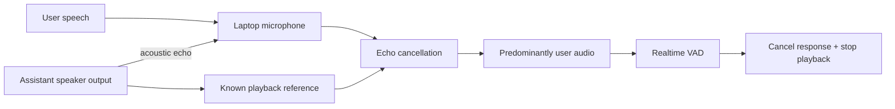

# Laptop speaker/microphone barge-in research

- **Status:** WebSocket barge-in complete; laptop AEC transport decision pending
- **Date:** 2026-08-01
- **Related roadmap item:** [Lobby Wake roadmap](../../TODO.md)

## Question

Can Lobby Wake support a natural full-duplex Realtime conversation using a
MacBook's built-in speakers and microphone, including user interruption while
the assistant is speaking?

## Short answer

Yes, but not through a VAD setting alone. The microphone contains both the
near-end user and the assistant audio played into the room. Server and semantic
VAD classify the mixed microphone signal; they do not identify which speaker
produced it. Acoustic echo cancellation (AEC) must remove the known assistant
playback before the microphone stream reaches VAD.

Increasing a VAD threshold can sometimes reject quieter echo, but it also
rejects quieter users and changes with speaker volume, microphone gain, room
geometry, and distance. It is not a reliable source-separation mechanism.

## Current harness behavior

Full duplex and WebSocket barge-in are now the default for headphones or an
already echo-cancelled input. On `input_audio_buffer.speech_started`, the client
aborts current and queued playback, estimates the heard offset from PCM playback
progress, sends `conversation.item.truncate`, ignores late audio deltas for the
interrupted item, and logs VAD-to-playback-stop latency and truncation state.

`--no-full-duplex` retains the previous half-duplex behavior for unprocessed
laptop speakers. It prevents speaker feedback by discarding microphone frames
during playback, so interruption is unavailable in that fallback mode.

An initial synthetic live test exercised the complete WebSocket path: remote VAD
detected the interrupt, local playback stopped in 116.83 ms, Realtime cancelled
the active response, truncation was confirmed at a 559 ms heard offset, and the
interrupting utterance received a completed response. This validates protocol
ownership only; it does not validate microphone acoustics or AEC.

OpenAI's [interruption and truncation guide][openai-interruption] distinguishes
the transports:

- WebRTC and SIP let the server manage output buffering and automatically
  truncate unplayed audio on interruption.
- With WebSockets, the client owns playback and must stop it, calculate the
  played duration, and send `conversation.item.truncate`.

## Candidate paths

| Path | Echo cancellation | Interruption ownership | Advantages | Costs / risks |
| --- | --- | --- | --- | --- |
| Headphones + current WebSocket | Physical isolation | Client | Fastest development baseline | Does not satisfy laptop-speaker UX |
| Browser/local WebRTC client | Browser media AEC | Server handles unplayed truncation | Mature client media path; OpenAI recommends WebRTC for client-side media | Adds browser/web runtime and ephemeral-session coordination |
| Native macOS voice-processing adapter | `AVAudioEngine` / Voice Processing I/O | Client if WebSocket remains | Native built-in-device behavior; no browser surface required | Swift/native boundary; client playback offset and truncation still required |
| Python DSP AEC | Separate DSP library plus exact playback reference | Client | Could preserve a Python-only process | Binding, delay alignment, device drift, tuning, and packaging risk |
| VAD threshold/noise tuning only | None | Client/server | Very low effort | Cannot reliably distinguish user from assistant echo |

OpenAI recommends WebRTC for client-side microphone media and WebSockets for
backend media pipelines in its [Realtime architecture guidance][openai-webrtc].
Browsers expose an `echoCancellation` microphone constraint that attempts to
remove system-generated output from the captured track; actual support can be
inspected through track settings and supported constraints. See [MDN's echo
cancellation reference][mdn-aec].

For a native path, Apple documents that voice-processing audio I/O or
`AVAudioEngine` with voice processing provides voice-specific processing such
as echo cancellation and automatic gain control. See [Apple's voice-chat audio
documentation][apple-voice].

## Recommended sequence

1. Validate the completed transport-independent WebSocket barge-in using
   headphones and collect interruption latency samples.
2. Build the smallest possible WebRTC AEC spike using the built-in MacBook
   microphone and speakers. Measure it rather than assuming browser AEC quality.
3. Build a native voice-processing spike only if WebRTC's runtime/packaging
   shape conflicts with the desired macOS library architecture.
4. Choose the media boundary with measured data, then record an ADR.

This sequence separates protocol correctness from echo-cancellation quality and
avoids rewriting wake detection or orchestration before the media path is known.

## Acceptance criteria

The laptop speaker/microphone item is complete when:

- assistant playback alone does not generate user `speech_started` events in a
  representative quiet room at normal listening volume;
- a user speaking over assistant playback stops audible playback within 250 ms
  p95 after local speech begins;
- the new user utterance is preserved and produces a response;
- the prior assistant item is truncated to the played audio offset, so model
  conversation state matches what the user heard;
- natural pauses do not cause unacceptable accidental turn termination;
- headphones and built-in devices both work without changing harness lifecycle
  ownership;
- structured logs expose interruption detection, playback stop, truncation,
  and next-response timing;
- a fallback half-duplex mode remains available when AEC cannot be enabled.

## Open questions for the spike

- Can a headless or embedded WebRTC client provide the desired AEC without
  making a browser UI part of the public library?
- Does native macOS voice processing require input and output to share one
  engine/device route for a usable echo reference?
- How should the harness react when users choose different input and output
  devices or Bluetooth routes?
- Should playback interruption begin on a local near-end detector before the
  remote `speech_started` event to reduce perceived barge-in latency?
- How much speaker leakage remains at realistic volume and user distance after
  each candidate AEC path?

[openai-interruption]: https://developers.openai.com/api/docs/guides/realtime-conversations#interruption-and-truncation
[openai-webrtc]: https://developers.openai.com/cookbook/examples/voice_solutions/realtime_translation_guide#choose-the-architecture-based-on-the-media-path
[mdn-aec]: https://developer.mozilla.org/en-US/docs/Web/API/MediaTrackConstraints/echoCancellation
[apple-voice]: https://developer.apple.com/documentation/avfaudio/avaudiosession/mode-swift.struct/videochat
